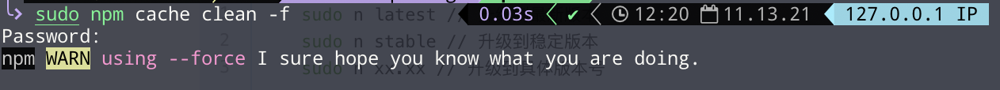
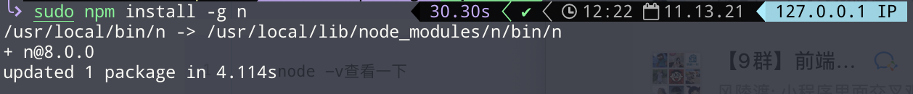
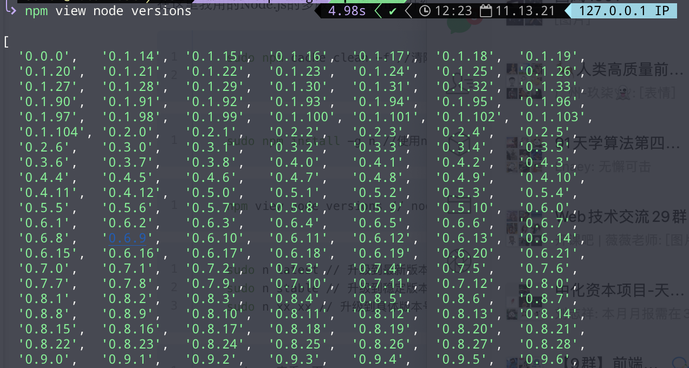
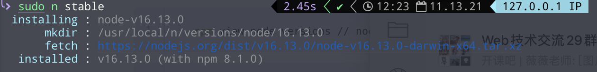

在这里我用的Node.js的多版本管理器n来升级的
```shell
  sudo npm cache clean -f //清除nodejs的cache
```


```shell
  sudo npm install -g n //使用npm安装n模块
```


```shell
  npm view node versions // node所有版本
```


```shell
  sudo n latest // 升级到最新版本
  sudo n stable // 升级到稳定版本
  sudo n xx.xx // 升级到具体版本号
```


```shell
  node -v查看一下
```